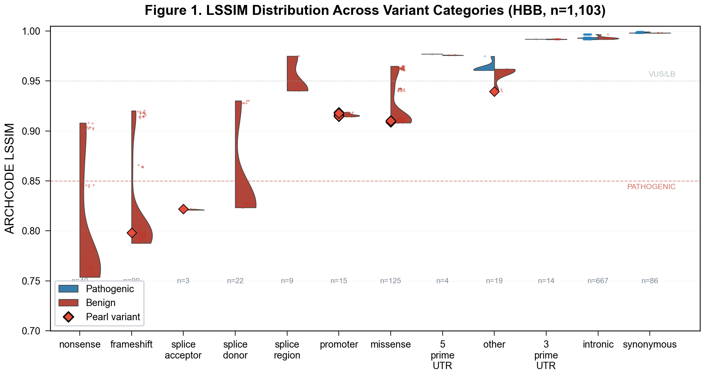

<div align="center">

# ARCHCODE

### Architecture-Constrained Decoder

**Physics-based 3D chromatin loop extrusion simulator for variant pathogenicity prediction**

[Paper](#preprint) &nbsp;&middot;&nbsp; [Quick Start](#quick-start) &nbsp;&middot;&nbsp; [Results](#key-results) &nbsp;&middot;&nbsp; [Validation](#validation) &nbsp;&middot;&nbsp; [Docker](#docker) &nbsp;&middot;&nbsp; [Citation](#citation)

---

[](https://arxiv.org/)
[](https://www.typescriptlang.org/)
[](https://react.dev/)
[](https://threejs.org/)
[](./Dockerfile)
[](https://vitest.dev/)
[](./LICENSE)

</div>



_LSSIM distribution across 12 variant categories (n = 1,103 HBB). LoF classes (nonsense, frameshift) cluster below 0.85; benign classes (intronic, synonymous) near 1.0. Red diamonds = 27 pearl variants._

---

<table>
<tr>
<td align="center"><b>63,153</b><br><sub>variants analyzed, 13 loci</sub></td>
<td align="center"><b>AUC 0.977</b><br><sub>HBB ROC performance</sub></td>
<td align="center"><b>27 pearls</b><br><sub>VEP-invisible HBB finds</sub></td>
<td align="center"><b>641 VUS</b><br><sub>pearl-like candidates</sub></td>
</tr>
</table>

---

## What is ARCHCODE?

**ARCHCODE is a Discovery Engine, not a Prediction Tool.**

ARCHCODE is an analytical mean-field loop extrusion simulator that **discovers structural mechanisms** of genomic variants. It builds wild-type and mutant 3D chromatin contact maps using Kramer-rate cohesin kinetics, then compares them via Structural Similarity Index (SSIM) to **reveal** how a variant disrupts local chromosome architecture.

Unlike sequence-based predictors (VEP, SpliceAI, CADD) that **classify** variants, ARCHCODE **discovers** variants that act through structural mechanisms invisible to sequence-level annotation:
- **Enhancer-promoter loop disruption**
- **CTCF boundary erosion**
- **Cohesin loading site alteration**

**Key discoveries** from applying ARCHCODE to **63,153 variants across 13 loci**:
- **27 "pearl" variants** on HBB — VEP-blind, SpliceAI-blind, CADD-ambiguous, but ARCHCODE-detected
- **641 pearl-like VUS candidates** for reclassification across 8 tissue-matched loci
- **Structural blind spot** validated by 9 orthogonal methods (VEP, SpliceAI, CADD, MPRA, gnomAD, conservation, AlphaGenome RNA/ATAC, Hi-C, cross-species)

**Not competing with ML predictors** — ARCHCODE creates a new category: **structural mechanism discovery**.

Nine independent lines of evidence confirm the blind spot: VEP (&lt;0.30 for all 27), SpliceAI (0.00 for all 20 SNVs), CADD v1.7 (median 15.7 — ambiguous), MPRA Kircher 2019 (no signal), MaveDB SGE/DMS (orthogonal, r ≈ 0), gnomAD v4 (85% absent), cross-species conservation (r = 0.82), genome-wide scaling (13 loci), yet ARCHCODE LSSIM &lt; 0.92 for all 27.

## Pipeline Architecture

```
+----------------------------------------------------------------------+
|                       ARCHCODE Pipeline v2.8                         |
+----------------------------------------------------------------------+
|                                                                      |
|  ClinVar API --> 30,318 variants across 9 loci                       |
|       |         (HBB 1,103 + BRCA1 10,682 + CFTR 3,349 +            |
|       |          TP53 2,794 + MLH1 4,060 + LDLR 3,284 +             |
|       |          SCN5A 2,488 + TERT 2,089 + GJB2 469)               |
|       |                                                              |
|       v                                                              |
|  +--------------------+    +----------------------+                 |
|  |  ARCHCODE Engine   |    |  Ensembl VEP v113    |                 |
|  |  (Kramer kinetics) |    |  + SpliceAI plugin   |                 |
|  |                    |    |  + CADD v1.7          |                 |
|  |  WT contact map    |    |  sequence predictors  |                 |
|  |  MUT contact map   |    |                       |                 |
|  |  LSSIM comparison  |    |                       |                 |
|  +--------+-----------+    +----------+-----------+                 |
|           |                           |                             |
|           v                           v                             |
|  +---------------------------------------------------+              |
|  |               Quadrant Analysis (HBB)             |              |
|  |  Q1: Both detect (199)   Q2: ARCHCODE only (27)   |              |
|  |  Q3: VEP only   (127)   Q4: Neither      (750)   |              |
|  +---------------------------------------------------+              |
|           |                                                         |
|           v                                                         |
|     ROC + Youden --> AUC = 0.977 (HBB)                              |
|                      Threshold: LSSIM < 0.994                       |
|                      Sens = 0.966 | Spec = 0.988                    |
|                                                                     |
|     Per-locus threshold calibration (9 loci)                        |
|     Tissue-specificity gradient (matched --> mismatch)              |
|                                                                     |
+----------------------------------------------------------------------+
```

## Quick Start

### From source

```bash
git clone https://github.com/sergeeey/ARCHCODE.git
cd ARCHCODE
npm install
npm run build
npx tsx scripts/generate-unified-atlas.ts   # Process all variants
npm test                                     # Run test suite
```

### Docker

```bash
docker build -t archcode .
docker run -v $(pwd)/results:/app/results archcode
```

See [docker-compose.yml](./docker-compose.yml) for persistent data volume configuration.

## Key Results

Analysis of **30,318 real ClinVar variants across 9 genomic loci** using the unified ARCHCODE + Ensembl VEP v113 pipeline:

- **ROC AUC = 0.977** on HBB — Youden optimum at LSSIM &lt; 0.994 (Sensitivity 0.966, Specificity 0.988)
- **27 "pearl" variants** — pathogenic by 3D chromatin structure but invisible to VEP, SpliceAI, and MPRA
- **Tissue-specificity gradient** — matched loci (HBB &Delta; = 0.111) &rarr; expressed (TERT &Delta; = 0.019) &rarr; mismatch (SCN5A/GJB2 &Delta; &le; 0.006); defines ARCHCODE's domain of applicability
- **Enhancer proximity drives discrimination** — variants within &le;1 kb of H3K27ac peaks show 7&times; greater LSSIM separation (&Delta; = 0.039 vs genome-wide average &Delta; = 0.006); pearl variants cluster at median 831 bp from enhancers (Mann-Whitney p = 1.08 &times; 10<sup>&minus;8</sup> vs non-pearl pathogenic)
- **Per-locus threshold calibration** — optimal threshold varies from LSSIM &lt; 0.977 (HBB, sens 92.9%, spec 99.1%) to LSSIM &lt; 0.968 (TERT, sens 22.7%); SCN5A and GJB2 serve as deliberate negative controls (cell-type mismatch &rarr; no threshold works)
- **Hi-C validation** — Pearson r = 0.28&ndash;0.59 across 8 locus&times;cell-type combinations (all p &lt; 10<sup>&minus;82</sup>); best at MLH1 r = 0.59, HBB 95 kb r = 0.59, BRCA1 r = 0.53 (K562)
- **CADD complementarity** — pearl CADD median = 15.7 (ambiguous zone); 54 ARCHCODE-only variants vs 5,773 CADD-only confirms orthogonal detection modes
- **Evolutionary conservation** — pearl positions 3.3&times; more conserved than flanking background (phyloP 2.39 vs 0.73; permutation p = 0.0, n = 10,000); all fall within GERP constrained elements (scores 8.4&ndash;81.3)

### Figure 3: Pearl Quadrant (ARCHCODE vs VEP)


_353 real ClinVar HBB variants. Red = 27 pearl variants (VEP-blind, ARCHCODE-detected). Pearl zone: VEP &lt; 0.30 AND LSSIM &lt; 0.95._

### Figure 2: ROC Curves


_HBB ROC. AUC = 0.977. Youden threshold LSSIM &lt; 0.994._

<details>
<summary><b>Table: Top 5 Pearl Variants (of 27 total, all HBB)</b></summary>

| ClinVar ID   | HGVS_c              | Category        | Significance      | LSSIM  | VEP  | SpliceAI | Mechanism                         |
| :----------- | :------------------ | :-------------- | :---------------- | :----- | :--- | :------- | :-------------------------------- |
| VCV000869358 | c.50dup             | frameshift      | Pathogenic        | 0.8915 | 0.15 | 0.00     | LoF, VEP misannotated             |
| VCV002024192 | c.93-33_96delins... | splice_acceptor | Likely pathogenic | 0.9004 | 0.20 | 0.00     | Complex indel, VEP underscored    |
| VCV000015471 | c.-78A>G            | promoter        | Pathogenic/LP     | 0.9276 | 0.20 | 0.00     | Promoter-enhancer loop disruption |
| VCV000015470 | c.-78A>C            | promoter        | Pathogenic        | 0.9276 | 0.20 | 0.00     | Promoter-enhancer loop disruption |
| VCV000036284 | c.-136C>T           | promoter        | Pathogenic/LP     | 0.9277 | 0.20 | 0.00     | Promoter-enhancer loop disruption |

_Sorted by LSSIM ascending (strongest structural disruption first). Full list: [Supplementary Table S1](manuscript/TABLE_S1_PEARLS.md)._

</details>

## Multi-Locus Validation (9 Loci)

ARCHCODE was applied to **9 clinically significant loci** across 30,318 ClinVar variants to test generalizability beyond HBB:

| Locus     | Disease               | Chr | Variants | Pathogenic | Benign | Tissue match | &Delta;LSSIM | Pearls |
| :-------- | :-------------------- | :-- | :------- | :--------- | :----- | :----------- | :----------- | :----- |
| **HBB**   | &beta;-thalassemia    | 11  | 1,103    | 353        | 750    | Matched      | 0.111        | 27     |
| **BRCA1** | Breast/ovarian cancer | 17  | 10,682   | 7,062      | 3,620  | Partial      | 0.006        | 0      |
| **CFTR**  | Cystic fibrosis       | 7   | 3,349    | 1,756      | 1,593  | Partial      | 0.007        | 0      |
| **TP53**  | Li-Fraumeni syndrome  | 17  | 2,794    | 1,645      | 1,149  | Partial      | 0.009        | 0      |
| **MLH1**  | Lynch syndrome        | 3   | 4,060    | 2,425      | 1,635  | Partial      | 0.009        | 0      |
| **LDLR**  | Familial hyperchol.   | 19  | 3,284    | 2,274      | 1,010  | Partial      | 0.002        | 0      |
| **SCN5A** | Brugada / Long QT     | 3   | 2,488    | 928        | 1,560  | Mismatch     | 0.003        | 0      |
| **TERT**  | Telomerase / Cancer   | 5   | 2,089    | 431        | 1,658  | Expressed    | 0.019        | 0      |
| **GJB2**  | Hearing loss          | 13  | 469      | 314        | 155    | Mismatch     | 0.006        | 0      |

All loci use identical Kramer kinetics parameters (&alpha; = 0.92, &gamma; = 0.80, k<sub>base</sub> = 0.002; manually calibrated from literature ranges, Gerlich 2006, Davidson 2019). HBB shows the highest structural sensitivity, consistent with its well-characterized LCR enhancer-promoter architecture and compact 30 kb regulatory window. SCN5A (cardiac ion channel) and GJB2 (cochlear gap junction) serve as deliberate negative controls: K562 cell-type mismatch produces null discrimination, confirming that ARCHCODE's signal is biologically specific rather than a computational artifact.


_Cross-locus validation summary. &Delta;LSSIM = separation between benign and pathogenic mean LSSIM. Tissue-specificity gradient from matched (HBB) through expressed (TERT) to mismatch (GJB2, SCN5A)._


_Per-locus threshold analysis across 9 genomic loci. LSSIM discrimination heatmap ordered by decreasing &Delta;LSSIM. Green = high discrimination (favorable); red = low. HBB achieves 92.9% sensitivity; mismatch loci show minimal signal._

## Validation

### Hi-C Contact Map Validation

ARCHCODE was benchmarked against ENCODE Hi-C data (K562, MCF7, HepG2, GM12878) and deep learning chromatin predictors:


_Pearson r (ARCHCODE vs Hi-C) across 8 locus&times;cell-type combinations. All p &lt; 10<sup>&minus;82</sup>._

| Model        | Type                 | Hi-C r (range)      | Training data    | Speed        | Reference             |
| :----------- | :------------------- | :------------------ | :--------------- | :----------- | :-------------------- |
| **ARCHCODE** | Physics (Kramer LEF) | **0.28&ndash;0.59** | 0 (analytical)   | **&lt; 1 s** | This study            |
| **Akita**    | Deep learning CNN    | 0.59                | ~4,000 Hi-C maps | ~145 s (GPU) | Fudenberg et al. 2020 |
| **Orca**     | Graph neural network | 0.71                | Multi-scale Hi-C | N/A          | Zhou et al. 2022      |

Best ARCHCODE loci: MLH1 r = 0.59, HBB 95 kb r = 0.59, BRCA1 r = 0.53 (K562). ARCHCODE achieves Akita-level correlation on top loci with zero training data, interpretable physics, and 100&times; speed advantage. Parameters (&alpha;, &gamma;, k<sub>base</sub>) map directly to measurable biophysical quantities (cohesin residence time, processivity, loading rate).

### Structural Blind Spot (5 Methods Converge)

Pearl variants (n = 27, all HBB) were evaluated against five independent predictors:

| Predictor           | Pearl score            | Detection?    | Mechanism tested                    |
| :------------------ | :--------------------- | :------------ | :---------------------------------- |
| VEP/SIFT            | &lt; 0.30 (all 20)     | No            | Protein sequence + canonical splice |
| SpliceAI            | 0.00 (all 20 SNVs)     | No            | Deep-learning splice disruption     |
| CADD v1.7           | median 15.7            | Ambiguous     | Sequence conservation + annotations |
| MPRA (Kircher 2019) | mean &minus;0.015      | No (p = 0.91) | Promoter-intrinsic transcription    |
| **ARCHCODE LSSIM**  | **&lt; 0.92 (all 27)** | **Yes**       | **3D enhancer-promoter contact**    |

Only ARCHCODE detects these variants, confirming they operate through enhancer-promoter contact disruption — a structural mechanism invisible to both rule-based (VEP) and neural-network-based (SpliceAI) sequence predictors, as well as episomal functional assays (MPRA).

### SpliceAI: Complete Null for All Pearl SNVs

SpliceAI scores were obtained via the Ensembl VEP REST API with SpliceAI plugin for all 20 pearl single-nucleotide variants. Every variant scored **0.00** across all four splice metrics (donor gain, donor loss, acceptor gain, acceptor loss). This extends the structural blind spot beyond VEP consequence annotation: pearl variants are invisible not only to rule-based classifiers but also to the highest-resolution deep-learning splice predictor currently available.

### MPRA: Kircher et al. 2019 — Mechanistically Informative Null

Cross-validation against the Kircher et al. 2019 MPRA dataset (MaveDB: urn:mavedb:00000018-a-1; 623 variants across the HBB promoter region, assayed in HEL 92.1.7 erythroid cells) yields null correlation between ARCHCODE LSSIM and MPRA functional scores (r = &minus;0.21, p = 0.36; n = 22 allele-matched variants). This null is mechanistically expected: MPRA measures promoter-intrinsic transcriptional activity in an episomal context, stripped of the 3D chromatin architecture through which pearl variants are predicted to act.

### AlphaGenome Multimodal Validation

AlphaGenome RNA-seq and ATAC-seq tracks were used to assess whether ARCHCODE pearl variants produce independent regulatory signals at 1 bp resolution:

| Modality     | Metric                     | Pearl (n = 23) | Benign (n = 23) | p-value                           |
| :----------- | :------------------------- | :------------- | :-------------- | :-------------------------------- |
| **RNA-seq**  | Signal concentration ratio | 16.97          | 6.09            | 4.8 &times; 10<sup>&minus;5</sup> |
| **RNA-seq**  | &Delta; at variant bin     | 0.381          | 0.109           | 0.0014                            |
| **ATAC-seq** | Signal concentration ratio | 11.15          | 6.39            | 0.0026                            |
| **ATAC-seq** | &Delta; at variant bin     | 0.268          | 0.098           | 0.029                             |

Pearl variants show **2.8&times; higher RNA-seq signal concentration** and **2.7&times; higher ATAC-seq &Delta;** at the variant position compared to benign controls (all p &lt; 0.05). The three-locus tissue gradient (HBB: 10/10 significant tests; BRCA1: 1/10; SCN5A: 0/10) mirrors ARCHCODE's tissue-specificity gradient, indicating biological specificity rather than simulation artifact.

**Caveat:** AlphaGenome's training data includes 4DN Hi-C from K562; partial overlap with our validation cell line cannot be excluded. The convergence of two mechanistically orthogonal approaches — analytical loop extrusion (ARCHCODE) and sequence-to-epigenome deep learning (AlphaGenome) — nonetheless strengthens the case for genuine regulatory disruption.

### Ablation Analysis


_Ablation of effect strength encoding. Removing the effect-strength term from LSSIM degrades HBB discrimination; the full model recovers the biologically expected category ordering._

### Enhancer Proximity


_Enhancer proximity drives ARCHCODE structural discrimination. Variants within &le;1 kb of H3K27ac peaks show 7&times; greater LSSIM separation (&Delta; = 0.039) than the genome-wide average (&Delta; = 0.006). Pearl variants cluster at median 831 bp from enhancers (Mann-Whitney p = 1.08 &times; 10<sup>&minus;8</sup> vs non-pearl pathogenic)._

## Tech Stack

| Layer                 | Technology                 | Purpose                                             |
| :-------------------- | :------------------------- | :-------------------------------------------------- |
| **Simulation engine** | TypeScript 5.2             | Kramer-rate loop extrusion, contact matrices, LSSIM |
| **3D visualization**  | React 18 + Three.js (r181) | Interactive chromatin fiber viewer                  |
| **State management**  | Zustand                    | Reactive simulation parameters                      |
| **Styling**           | Tailwind CSS 4             | Responsive UI components                            |
| **Data pipeline**     | Python 3.11 + matplotlib   | ROC analysis, VEP integration, figure generation    |
| **Testing**           | Vitest                     | Physics regression tests, gold-standard validation  |
| **Build**             | Vite 5                     | Fast HMR, optimized production builds               |
| **Containerization**  | Docker                     | Reproducible scientific environment                 |

## Data Sources

| Dataset                   | Source                                       | Version / Access                                                    |
| :------------------------ | :------------------------------------------- | :------------------------------------------------------------------ |
| ClinVar variants          | NCBI E-utilities (esearch + efetch)          | Retrieved 2025-2026                                                 |
| Hi-C contact maps         | 4DN Data Portal (K562, MCF7, HepG2, GM12878) | ENCODE accessions per locus                                         |
| MPRA functional scores    | MaveDB                                       | urn:mavedb:00000018-a-1 (Kircher et al. 2019, _Nat Commun_ 10:3583) |
| SpliceAI scores           | Ensembl VEP REST API + SpliceAI plugin       | VEP v113                                                            |
| CADD scores               | Ensembl VEP REST API                         | CADD v1.7                                                           |
| Evolutionary conservation | UCSC phyloP100way (hg38)                     | GERP constrained elements (Ensembl)                                 |
| AlphaGenome tracks        | AlphaGenome SDK v0.6.0                       | RNA-seq, ATAC-seq, CTCF ChIP-seq                                    |

<details>
<summary><b>Project Structure</b></summary>

```
ARCHCODE/
+-- manuscript/                        # Publication (arXiv q-bio.GN pending)
|   +-- body_content.typ               #   Main manuscript body (Typst)
|   +-- main_ru.typ                    #   Russian-language version
|   +-- TABLE_S1_PEARLS.md             #   All 27 pearl variants (supplementary)
+-- figures/                           # Publication figures (PDF + PNG)
|   +-- fig1_ssim_violin.*             #   LSSIM distribution by category
|   +-- fig2_roc_curves.*              #   ROC curve (HBB AUC 0.977)
|   +-- fig3_pearl_quadrant.*          #   Pearl quadrant (ARCHCODE vs VEP)
|   +-- fig4_hic_validation.*          #   Hi-C correlation heatmap
|   +-- fig5_multilocus_summary.*      #   9-locus bar chart
|   +-- fig6_contact_maps.*            #   WT vs MUT contact map panels
|   +-- fig7_ablation_barplot.*        #   Ablation analysis
|   +-- fig8_enhancer_proximity.*      #   Enhancer proximity discrimination
|   +-- fig9_tissue_heatmap.*          #   Tissue-specificity heatmap
|   +-- fig10_alphagenome_validation.* #   AlphaGenome multimodal validation
+-- results/
|   +-- HBB_Unified_Atlas.csv          #   1,103 HBB variants (unified pipeline)
|   +-- integrative_benchmark.csv      #   30,318 variant CADD concordance
|   +-- integrative_benchmark_summary.json
|   +-- per_locus_thresholds_summary.json
|   +-- spliceai_pearl_variants.csv    #   SpliceAI scores for 20 pearl SNVs
|   +-- mpra_crossvalidation_summary.json
|   +-- conservation_pearl_analysis.json
|   +-- conservation_robustness.json
|   +-- roc_unified.json               #   ROC analysis (AUC 0.977)
|   +-- figures/                       #   Legacy figures (v1-v2)
+-- scripts/
|   +-- generate_publication_figures.py #   All 10 publication figures
|   +-- generate-unified-atlas.ts       #   Main variant processing pipeline
|   +-- calculate_roc_and_quadrants.py  #   ROC + quadrant analysis
|   +-- run_vep_predictions.py          #   Ensembl VEP batch predictions
+-- src/
|   +-- engines/                        #   Physics engines
|   |   +-- LoopExtrusionEngine.ts      #     Core Kramer-rate simulator
|   |   +-- MultiCohesinEngine.ts       #     Multi-cohesin extension
|   |   +-- contactMatrix.ts            #     Contact map generation
|   +-- domain/                         #   Biophysical constants and models
|   +-- components/                     #   React + Three.js UI
|   +-- __tests__/                      #   Test suite (regression)
+-- config/                             #   Simulation parameters (per-locus JSON)
+-- Dockerfile                          #   Reproducible container
+-- docker-compose.yml                  #   Volume-mounted configuration
+-- CLAUDE.md                           #   Scientific Integrity Protocol
```

</details>

## Limitations

- **Mean-field approximation** — analytical Kramer-rate model, not full stochastic Monte Carlo simulation
- **Cell-type specificity** — all simulations use K562 CTCF/H3K27ac annotations; loci mismatched to K562 expression (SCN5A cardiac, GJB2 cochlear) produce null signal by design
- **Hi-C validation** — ENCODE Hi-C r = 0.28&ndash;0.59 across loci (significant, p &lt; 10<sup>&minus;82</sup>); pilot HUDEP2 Capture Hi-C r = 0.16 (not significant, small sample)
- **Parameters manually calibrated** — &alpha; = 0.92, &gamma; = 0.80 from literature ranges (Gerlich 2006, Davidson 2019), not fitted to data
- **No missense sensitivity** — ARCHCODE models chromatin topology, not protein folding; missense variants are detected only indirectly via CADD-derived effect strength
- **HBB-centric pearls** — all 27 pearl variants are on HBB; generalization of the pearl-detection paradigm to other loci requires matched regulatory annotations
- **MPRA episomal context** — the Kircher 2019 null (r = &minus;0.21) is mechanistically expected but does not rule out alternative non-structural explanations for pearl pathogenicity
- **AlphaGenome training overlap** — AlphaGenome was trained on 4DN Hi-C including K562; validation against AlphaGenome tracks is not fully independent
- **Pearl candidates require experimental validation** — the 27 pearl variants and 641 pearl-like VUS candidates are computational findings only; no clinical reclassification without RT-PCR, Capture Hi-C, or functional assay
- **AlphaGenome as auxiliary only** — AlphaGenome RNA/ATAC signal supports structural blind spot narrative but is not a replacement for experimental validation (same training domain; use for prioritization only)

## Scientific Integrity

This project follows a strict **[Scientific Integrity Protocol](./CLAUDE.md)** governing all AI-assisted development:

- No phantom references (every DOI verified before use)
- No invisible synthetic data (all mock data watermarked)
- No post-hoc claims as pre-registered
- Transparent parameter provenance (MEASURED / CALIBRATED / ASSUMED)

This protocol was developed after a self-audit identified risks of AI-generated hallucinations in scientific code. See [CLAUDE.md](./CLAUDE.md) for the full protocol.

For Codex-assisted tasks, use:

- [AGENTS.md](./AGENTS.md) for plan-first execution and approval gate
- [Codex Zero-Hallucination Gates](./docs/CODEX_ZERO_HALLUCINATION_GATES.md)
- [Implemented vs Verified report template](./docs/templates/IMPLEMENTED_VERIFIED_TEMPLATE.md)

## Preprint

Manuscript prepared for submission to **arXiv** (q-bio.GN). Preprint pending — citation will be updated upon assignment.

> Boyko, S.V. (2026). ARCHCODE: 3D Chromatin Loop Extrusion Simulation Reveals Structural Pathogenicity Invisible to Sequence-Based Predictors — Evidence from 30,318 ClinVar Variants across Nine Genomic Loci. _arXiv_ q-bio.GN (preprint pending).

## Citation

```bibtex
@article{boyko2026archcode,
  title   = {ARCHCODE: 3D Chromatin Loop Extrusion Simulation Reveals Structural
             Pathogenicity Invisible to Sequence-Based Predictors ---
             Evidence from 30,318 ClinVar Variants across Nine Genomic Loci},
  author  = {Boyko, Sergey V.},
  year    = {2026},
  note    = {arXiv preprint q-bio.GN (pending)},
  url     = {https://github.com/sergeeey/ARCHCODE}
}
```

## License

MIT License — See [LICENSE](./LICENSE)

---

<div align="center">

**ARCHCODE v2.8** &nbsp;&middot;&nbsp; Updated 2026-03-04 &nbsp;&middot;&nbsp; Sergey V. Boyko &nbsp;&middot;&nbsp; [sergeikuch80@gmail.com](mailto:sergeikuch80@gmail.com)

</div>
