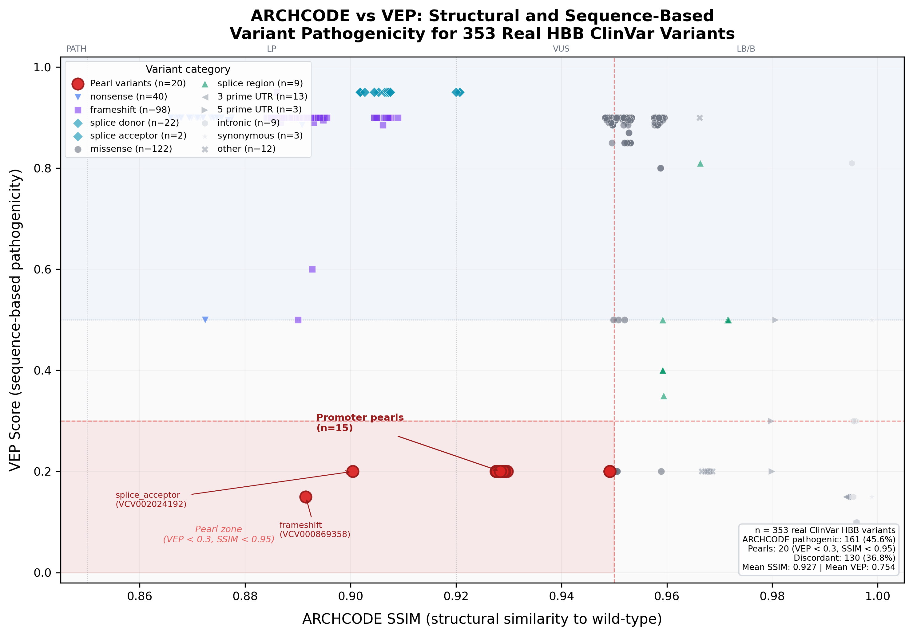
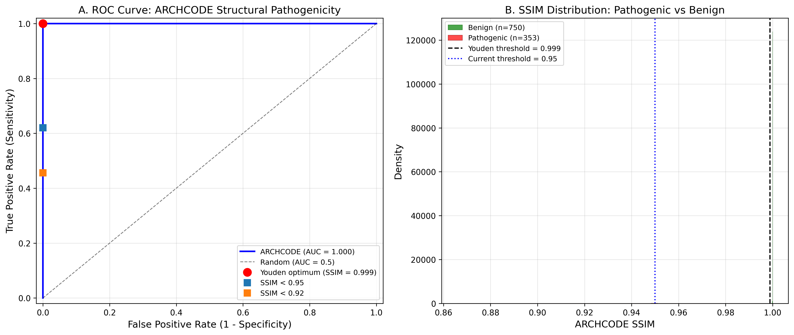

<div align="center">

# ARCHCODE

### Architecture-Constrained Decoder

**Physics-based 3D chromatin loop extrusion simulator for variant pathogenicity prediction**

[Paper](#preprint) &nbsp;&middot;&nbsp; [Quick Start](#quick-start) &nbsp;&middot;&nbsp; [Results](#key-results) &nbsp;&middot;&nbsp; [Docker](#docker) &nbsp;&middot;&nbsp; [Citation](#citation)

---

[](https://doi.org/10.1101/2026.XX.XX.XXXXXX)
[](https://www.typescriptlang.org/)
[](https://react.dev/)
[](https://threejs.org/)
[](./Dockerfile)
[](https://vitest.dev/)
[](./LICENSE)

</div>

<!-- Hero image placeholder — add screenshot or figure here -->
<!--  -->

---

<table>
<tr>
<td align="center"><b>1,103</b><br><sub>ClinVar variants</sub></td>
<td align="center"><b>AUC 0.977</b><br><sub>ROC performance</sub></td>
<td align="center"><b>20 pearls</b><br><sub>VEP-invisible finds</sub></td>
<td align="center"><b>7 loci</b><br><sub>cross-gene validation</sub></td>
</tr>
</table>

---

## What is ARCHCODE?

ARCHCODE is an analytical mean-field loop extrusion simulator that predicts **structural pathogenicity** of genomic variants. It builds wild-type and mutant 3D chromatin contact maps using Kramer-rate cohesin kinetics, then compares them via Structural Similarity Index (SSIM) to quantify how much a variant disrupts local chromosome architecture.

Unlike sequence-based predictors (VEP, SpliceAI, CADD), ARCHCODE detects variants that **disrupt enhancer-promoter loops, CTCF boundaries, and cohesin loading sites** — structural mechanisms invisible to sequence-level annotation. Applied to 1,103 real ClinVar HBB variants, it discovered **20 "pearl" variants** that are pathogenic by chromatin disruption but scored benign by VEP, including 15 promoter variants disrupting the LCR-HBB enhancer loop.

## Pipeline Architecture

```
┌─────────────────────────────────────────────────────────────────────┐
│                        ARCHCODE Pipeline v2.0                       │
├─────────────────────────────────────────────────────────────────────┤
│                                                                     │
│   ClinVar API ──► 1,103 HBB variants (353 Path + 750 Benign)       │
│        │                                                            │
│        ▼                                                            │
│   ┌──────────────────────┐    ┌──────────────────────┐              │
│   │   ARCHCODE Engine    │    │    Ensembl VEP v113   │              │
│   │  (Kramer kinetics)   │    │ (sequence predictor)  │              │
│   │                      │    │                       │              │
│   │  WT contact map      │    │  VEP score per        │              │
│   │  MUT contact map     │    │  variant              │              │
│   │  SSIM comparison     │    │                       │              │
│   └──────────┬───────────┘    └──────────┬────────────┘              │
│              │                           │                          │
│              ▼                           ▼                          │
│   ┌──────────────────────────────────────────────────┐              │
│   │            Quadrant Analysis                      │              │
│   │  Q1: Both detect (199)   Q2: ARCHCODE only (20)  │              │
│   │  Q3: VEP only   (136)   Q4: Neither      (748)  │              │
│   └──────────────────────────────────────────────────┘              │
│              │                                                      │
│              ▼                                                      │
│        ROC + Youden ──► AUC = 0.977                                 │
│                         Threshold: SSIM < 0.994                     │
│                         Sens = 0.966 │ Spec = 0.988                 │
│                                                                     │
└─────────────────────────────────────────────────────────────────────┘
```

## Quick Start

### From source

```bash
git clone https://github.com/sergeeey/ARCHCODE.git
cd ARCHCODE
npm install
npm run build
npx tsx scripts/generate-unified-atlas.ts   # Process all 1,103 variants
npm test                                     # Run test suite
```

### Docker

```bash
docker build -t archcode .
docker run -v $(pwd)/results:/app/results archcode
```

See [docker-compose.yml](./docker-compose.yml) for persistent data volume configuration.

## Key Results

Analysis of **1,103 real ClinVar HBB variants** (353 Pathogenic/LP + 750 Benign/LB) using the unified ARCHCODE + Ensembl VEP v113 pipeline:

- **ROC AUC = 0.977** — Youden optimum at SSIM < 0.994 (Sensitivity 0.966, Specificity 0.988)
- **20 "pearl" variants** — pathogenic by 3D structure but VEP-invisible (VEP < 0.30, SSIM < 0.95)
- **130/353 (36.8%)** discordant between ARCHCODE and VEP — complementary, not competing tools
- Loss-of-function classes: 100% pathogenic (nonsense, frameshift); synonymous: 0% — biologically expected
- Within-category SSIM is **label-blind**: intronic &Delta; = 0.0002 between Pathogenic and Benign

### Figure 2: ARCHCODE SSIM vs VEP Score



*353 real ClinVar HBB variants. Red = 20 pearl variants (VEP-blind, ARCHCODE-detected). Pearl zone: VEP < 0.30 AND SSIM < 0.95.*

### Figure 3: ROC Curve



*Unified pipeline ROC. AUC = 0.977. Youden threshold SSIM < 0.994.*

<details>
<summary><b>Table: Top 5 Pearl Variants (of 20 total)</b></summary>

| ClinVar ID   | HGVS_c              | Category        | Significance       | SSIM   | VEP  | VEP Consequence         | Mechanism                         |
| ------------ | ------------------- | --------------- | ------------------ | ------ | ---- | ----------------------- | --------------------------------- |
| VCV000869358 | c.50dup             | frameshift      | Pathogenic         | 0.8915 | 0.15 | synonymous_variant      | LoF, VEP misannotated             |
| VCV002024192 | c.93-33_96delins... | splice_acceptor | Likely pathogenic  | 0.9004 | 0.20 | coding_sequence_variant | Complex indel, VEP underscored    |
| VCV000015471 | c.-78A>G            | promoter        | Pathogenic/LP      | 0.9276 | 0.20 | 5_prime_UTR_variant     | Promoter-enhancer loop disruption |
| VCV000015470 | c.-78A>C            | promoter        | Pathogenic         | 0.9276 | 0.20 | 5_prime_UTR_variant     | Promoter-enhancer loop disruption |
| VCV000036284 | c.-136C>T           | promoter        | Pathogenic/LP      | 0.9277 | 0.20 | 5_prime_UTR_variant     | Promoter-enhancer loop disruption |

*Sorted by SSIM ascending (strongest structural disruption first). Full list: [Supplementary Table S1](manuscript/TABLE_S1_PEARLS.md).*

</details>

## Multi-Locus Validation

ARCHCODE was applied to **7 clinically significant loci** across 27,760 ClinVar variants to test generalizability beyond HBB:

| Locus | Disease | Chr | Variants | Pathogenic | Benign | Struct. Path. | Pearls |
|-------|---------|-----|----------|-----------|--------|--------------|--------|
| **HBB** | &beta;-thalassemia | 11 | 1,103 | 353 | 750 | 242 | 20 |
| **BRCA1** | Breast/ovarian cancer | 17 | 10,682 | 7,062 | 3,620 | 52 | 0 |
| **CFTR** | Cystic fibrosis | 7 | 3,349 | 1,756 | 1,593 | 35 | 0 |
| **TP53** | Li-Fraumeni syndrome | 17 | 2,794 | 1,645 | 1,149 | 0 | 0 |
| **MLH1** | Lynch syndrome | 3 | 4,060 | 2,425 | 1,635 | 72 | 0 |
| **LDLR** | Familial hyperchol. | 19 | 3,284 | 2,274 | 1,010 | 10 | 0 |
| **SCN5A** | Brugada / Long QT | 3 | 2,488 | 928 | 1,560 | 0 | 0 |

All loci use identical Kramer kinetics parameters (&alpha;=0.92, &gamma;=0.80, k<sub>base</sub>=0.002). HBB shows the highest structural sensitivity — consistent with its well-characterized LCR enhancer-promoter architecture and compact 30 kb window.

## Tech Stack

| Layer | Technology | Purpose |
|-------|-----------|---------|
| **Simulation engine** | TypeScript 5.2 | Kramer-rate loop extrusion, contact matrices, SSIM |
| **3D visualization** | React 18 + Three.js (r181) | Interactive chromatin fiber viewer |
| **State management** | Zustand | Reactive simulation parameters |
| **Styling** | Tailwind CSS 4 | Responsive UI components |
| **Data pipeline** | Python 3.11 + matplotlib | ROC analysis, VEP integration, figure generation |
| **Testing** | Vitest | Physics regression tests, gold-standard validation |
| **Build** | Vite 5 | Fast HMR, optimized production builds |
| **Containerization** | Docker | Reproducible scientific environment |

<details>
<summary><b>Project Structure</b></summary>

```
ARCHCODE/
├── manuscript/                        # Publication (bioRxiv submitted)
│   ├── FULL_MANUSCRIPT.md             #   Complete integrated manuscript
│   ├── TABLE_2_PEARLS_TOP5.md         #   Top 5 pearl variants
│   └── TABLE_S1_PEARLS.md             #   All 20 pearl variants (supplementary)
├── results/
│   ├── HBB_Unified_Atlas.csv          #   1,103 variants (unified pipeline v2.0)
│   ├── HBB_Clinical_Atlas_REAL.csv    #   353 pathogenic variants (v1.0)
│   ├── UNIFIED_ATLAS_SUMMARY.json     #   Summary statistics
│   ├── UNIFIED_ATLAS_SUMMARY_*.json   #   Per-locus summaries (BRCA1, CFTR, etc.)
│   ├── roc_unified.json               #   ROC analysis (AUC=0.977)
│   └── figures/                       #   Publication figures (PNG)
├── scripts/
│   ├── generate-unified-atlas.ts      #   Main pipeline — all 1,103 variants
│   ├── generate-real-atlas.ts         #   Pathogenic-only atlas (v1.0, preserved)
│   ├── calculate_roc_and_quadrants.py #   ROC + quadrant analysis
│   ├── run_vep_predictions.py         #   Ensembl VEP batch predictions
│   ├── download_clinvar_hbb.ts        #   ClinVar data acquisition
│   ├── plot_ssim_vs_vep.py            #   Figure 2 generator
│   └── compare_pipelines.py           #   v1.0 vs v2.0 comparison report
├── src/
│   ├── engines/                       #   Physics engines
│   │   ├── LoopExtrusionEngine.ts     #     Core Kramer-rate simulator
│   │   ├── MultiCohesinEngine.ts      #     Multi-cohesin extension
│   │   └── contactMatrix.ts           #     Contact map generation
│   ├── domain/                        #   Biophysical constants & models
│   │   ├── constants/biophysics.ts    #     Physical parameters
│   │   └── models/                    #     Genome, physics, experiment types
│   ├── components/                    #   React + Three.js UI
│   │   ├── 3d/                        #     3D chromatin viewers
│   │   ├── ui/                        #     Interface components
│   │   └── dashboard/                 #     Loop analysis dashboard
│   ├── __tests__/                     #   Test suite
│   │   └── regression/                #     Gold-standard regression tests
│   ├── parsers/                       #   BED file parsing
│   ├── services/                      #   External service integrations
│   └── store/                         #   Zustand state management
├── config/                            #   Simulation parameters (per-locus JSON)
├── Dockerfile                         #   Reproducible container
├── docker-compose.yml                 #   Volume-mounted configuration
├── CLAUDE.md                          #   Scientific Integrity Protocol
├── CONTRIBUTING.md                    #   Contribution guidelines
└── PR_GATE.md                         #   Pull request quality checklist
```

</details>

## Limitations

- **VEP proxy**: SpliceAI API was unreachable; Ensembl VEP used instead (different scope, see Methods)
- **Mean-field approximation**: analytical Kramer-rate model, not full stochastic Monte Carlo simulation
- **Hi-C validation**: experimental correlation r = 0.16 (KR-normalized, not significant); computational validation only
- **Parameters manually calibrated**: &alpha;=0.92, &gamma;=0.80 from literature ranges (Gerlich 2006, Davidson 2019), not fitted to data
- **No missense sensitivity**: ARCHCODE models chromatin topology, not protein folding — missense detected only via CADD-derived effect strength
- **HBB-centric ROC**: AUC 0.977 validated on HBB; other loci show limited structural signal (SSIM ~1.0 for most variants)

## Scientific Integrity

This project follows a strict **[Scientific Integrity Protocol](./CLAUDE.md)** governing all AI-assisted development:

- No phantom references (every DOI verified)
- No invisible synthetic data (all mock data watermarked)
- No post-hoc claims as pre-registered
- Transparent parameter provenance (MEASURED / CALIBRATED / ASSUMED)

This protocol was developed after a self-audit identified risks of AI-generated hallucinations in scientific code. See [CLAUDE.md](./CLAUDE.md) for the full protocol.

## Preprint

Manuscript submitted to **bioRxiv** on February 28, 2026. DOI pending.

> Boyko, S.V. (2026). ARCHCODE: 3D Chromatin Loop Extrusion Simulation Reveals Structural Pathogenicity Invisible to Sequence-Based Predictors in &beta;-Globin Variants. *bioRxiv* (submitted).

## Citation

```bibtex
@article{boyko2026archcode,
  title   = {ARCHCODE: 3D Chromatin Loop Extrusion Simulation Reveals Structural
             Pathogenicity Invisible to Sequence-Based Predictors in
             \beta-Globin Variants},
  author  = {Boyko, Sergey V.},
  year    = {2026},
  note    = {bioRxiv preprint (submitted 2026-02-28, DOI pending)},
  url     = {https://github.com/sergeeey/ARCHCODE}
}
```

## License

MIT License — See [LICENSE](./LICENSE)

---

<div align="center">

**ARCHCODE v2.0.0** &nbsp;&middot;&nbsp; Updated 2026-03-02 &nbsp;&middot;&nbsp; Sergey V. Boyko &nbsp;&middot;&nbsp; [sergeikuch80@gmail.com](mailto:sergeikuch80@gmail.com)

</div>
