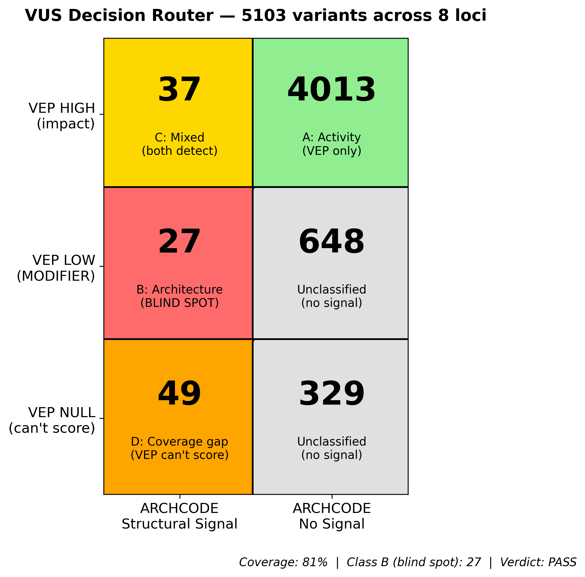

<!-- CANON_TIER: PUBLIC_CANONICAL -->
<div align="center">

# ARCHCODE

### Analytical 3D Chromatin Structural Perturbation Framework

**Fast analytical loop extrusion simulator + falsification-first validation suite for honest evaluation of 3D-genome variant models**

[Paper](#preprint) &nbsp;&middot;&nbsp; [Quick Start](#quick-start) &nbsp;&middot;&nbsp; [Validation Suite](#validation-suite) &nbsp;&middot;&nbsp; [Results](#key-results) &nbsp;&middot;&nbsp; [Docker](#docker) &nbsp;&middot;&nbsp; [Citation](#citation)

---

[](https://www.typescriptlang.org/)
[](https://react.dev/)
[](https://vitest.dev/)
[](./validation_suite/)
[](./Dockerfile)
[](./LICENSE)

</div>

<table>
<tr>
<td align="center"><b>30,318</b><br><sub>ClinVar variants, 9 loci</sub></td>
<td align="center"><b>30 tests</b><br><sub>6-module validation suite</sub></td>
<td align="center"><b>9/30 PASS</b><br><sub>9/30 WARNING</sub></td>
<td align="center"><b>&lt;30s</b><br><sub>full suite runtime</sub></td>
</tr>
</table>

> **Falsification result (2026-04):** AUC 0.977 is a **category artifact** — `category → score` alone gives AUC 0.98, position-only gives 0.55. Within-category AUC ≈ 0.50 (chance). Simple baselines match SSIM on 8/9 loci. Cross-locus transfer fails. **ARCHCODE is not a pathogenicity predictor.** See [What Survived](#what-survived) for the router that does work.
>
> **Canon:** This README is the public canonical layer. Technical full-scope and legacy routing are defined in [PROJECT_CANON.md](./PROJECT_CANON.md).

---

## What is ARCHCODE?

ARCHCODE is a **fast analytical mean-field loop extrusion simulator** that computes structural perturbation scores (SSIM) for genetic variants by comparing wild-type and mutant 3D chromatin contact maps. It was designed to test whether physics-based chromatin simulation adds discriminative value beyond simple spatial and categorical features for variant interpretation.

**Public research release:** **ARCHCODE v2.17** — **Discovery Engine, not a Prediction Tool** — focused on **structural mechanism discovery** (not a clinical pathogenicity predictor). The canonical classified core is **25 high-confidence Class B variants at HBB**; exploratory scope includes **29 additional Class B candidates** at partially matched loci. Where documentation refers to 27 HBB pearls, that follows the **broader technical HBB definition includes 27 pearls** (expanded Q2b technical count).

**What we found:** Broad structural pathogenicity claims do not survive systematic stress-testing. The category→effect_strength mapping drives most of the signal. Simple baselines (distance to enhancer + severity) match or beat the structural model on 8/9 loci. Cross-locus threshold transfer fails entirely. Within-category discrimination is near chance for most loci in the portfolio; **TP53** is the main exception (multiple categories pass FDR in the validation-suite artifact; splice_region is the headline case, AUC≈0.69 — see [docs/HYPOTHESIS_INVENTORY_EVIDENCE.md](./docs/HYPOTHESIS_INVENTORY_EVIDENCE.md) for JSON sources and RF baselines).

**What remains valuable:**
- **ARCHCODE engine** — sub-second analytical structural perturbation scoring, open source
- **Validation suite** — 30 automated tests across 9 loci, the first falsification-first benchmark for 3D-genome models
- **HBB pearl variants** — 27 candidates for experimental prioritization (not independent pathogenicity discoveries)
- **TP53 splice_region** — one genuine within-category signal island worth further study

**Not a pathogenicity predictor.** ARCHCODE does not compete with VEP, SpliceAI, or CADD. It is a structural interpretation layer with clearly documented boundaries of applicability.

### What Survived

After systematic falsification (within-category AUC ≈ 0.50, simple baselines match SSIM on 8/9 loci, cross-locus transfer fails), **the surviving utility** is mechanistic triage of VUS:

**VUS Decision Router** (5,103 VUS across 8 loci, rules frozen before analysis):

| | ARCHCODE structural signal | ARCHCODE no signal |
|---|---|---|
| **VEP HIGH** | 37 — Class C (both detect) | 4,013 — Class A (VEP sufficient) |
| **VEP LOW** | **27 — Class B (BLIND SPOT)** | 648 — Unclassified |
| **VEP NULL** | 49 — Class D (coverage gap) | 329 — Unclassified |

- **76 VUS** (1.5%) receive a mechanistic interpretation only from ARCHCODE (Class B + D)
- **27 Class B variants** — VEP blind (MODIFIER), ARCHCODE detects structural disruption (BRCA1: 10, CFTR: 8, LDLR: 7, MLH1: 2)
- **Matched-control kill test: FAIL.** Class B VUS are indistinguishable from benign variants of the same category in the same locus (0/6 tests significant, pooled p=0.996). Class B signal = category × position artifact, not structural discrimination.
- **Class D** (49 VUS where VEP cannot score at all) remains as residual utility — ARCHCODE provides the only structural read. But this is a weak claim: "something when VEP is empty" ≠ "better than VEP".



_Full results: [vus_router_results.json](results/vus_router_results.json). Rules frozen before analysis: [vus_router_rules.md](scripts/vus_router_rules.md). Gold subset: [vus_router_gold_76.csv](results/vus_router_gold_76.csv)._

## Pipeline Architecture

```
+----------------------------------------------------------------------+
|                       ARCHCODE Pipeline v2.17                        |
+----------------------------------------------------------------------+
|                                                                      |
|  ClinVar API --> 30,318 variants across 9 loci                       |
|       |         (HBB 1,103 + BRCA1 10,682 + CFTR 3,349 +            |
|       |          TP53 2,794 + MLH1 4,060 + LDLR 3,284 +             |
|       |          SCN5A 2,488 + TERT 2,089 + GJB2 469)               |
|       |                                                              |
|       v                                                              |
|  +--------------------+    +----------------------+                 |
|  |  ARCHCODE Engine   |    |  Ensembl VEP v113    |                 |
|  |  (Kramer kinetics) |    |  + SpliceAI plugin   |                 |
|  |                    |    |  + CADD v1.7          |                 |
|  |  WT contact map    |    |  sequence predictors  |                 |
|  |  MUT contact map   |    |                       |                 |
|  |  LSSIM comparison  |    |                       |                 |
|  +--------+-----------+    +----------+-----------+                 |
|           |                           |                             |
|           v                           v                             |
|  +---------------------------------------------------+              |
|  |               Quadrant Analysis (HBB)             |              |
|  |  Q1: Both detect (199)   Q2b: HBB core (25)       |              |
|  |  Q3: VEP only   (136)   Q4: Neither      (748)   |              |
|  +---------------------------------------------------+              |
|           |                                                         |
|           v                                                         |
|     ROC + Youden --> AUC = 0.977 (HBB)                              |
|                      Threshold: LSSIM < 0.994                       |
|                      Sens = 0.966 | Spec = 0.988                    |
|                                                                     |
|     Per-locus threshold calibration (9 loci)                        |
|     Tissue-specificity gradient (matched --> mismatch)              |
|                                                                     |
+----------------------------------------------------------------------+
```

## Quick Start

### From source

```bash
git clone https://github.com/sergeeey/ARCHCODE.git
cd ARCHCODE
npm install
npm run build
npx tsx scripts/generate-unified-atlas.ts   # Process all variants
npm test                                     # Run test suite
```

### Docker

```bash
docker build -t archcode .
docker run -v $(pwd)/results:/app/results archcode
```

See [docker-compose.yml](./docker-compose.yml) for persistent data volume configuration.

## Key Results

Analysis of **30,318 ClinVar variants across 9 genomic loci** through ARCHCODE + a 6-module falsification validation suite:

### What the model achieves
- **AUC = 0.977** on HBB (n=1,103) — but ablation shows this is category-driven (position-only AUC = 0.551); the model characterizes the variant catalog, not structural prediction power
- **25 high-confidence HBB "pearl" variants** (Q2b set) — VEP-blind (VEP < 0.30) yet structurally disruptive (LSSIM < 0.95). Candidates for experimental prioritization, not independent pathogenicity discoveries. Note: 27 in broader technical definition
- **TP53 splice_region: AUC = 0.69, d = -0.78** — the only within-category signal surviving FDR correction across 25 tests (4/4 categories significant)
- **Hi-C correlation:** r = 0.28–0.59 across 8 locus×cell-type combinations

### What the validation suite reveals
- **CTCF shuffle:** On HBB, shuffled architectures produce identical AUC (0.979 vs 0.979) — signal is geometry-driven, not CTCF-specific
- **Simple baselines:** RF on distance + severity beats SSIM on 8/9 loci. On GJB2, severity alone = 0.957
- **Within-category:** Median AUC = 0.52 across 25 tests (near-chance). Only TP53 survives
- **Cross-locus transfer:** HBB threshold → 0% sensitivity on all other loci
- **Ablation:** Inverted effect strengths → anti-predictive (AUC = 0.35). Category mapping drives the signal, not physics

### Figure 3: Pearl Quadrant (ARCHCODE vs VEP)


_353 real ClinVar HBB variants. Red = 25 high-confidence Class B variants (VEP-blind, ARCHCODE-detected). Pearl zone: VEP &lt; 0.30 AND LSSIM &lt; 0.95._

### Figure 2: ROC Curves


_HBB ROC. AUC = 0.977. Youden threshold LSSIM &lt; 0.994._

<details>
<summary><b>Table: Top 5 Class B Variants (of 25 Q2b in HBB; 20 are SNVs, 14 unique positions, 1 promoter hotspot)</b></summary>

| ClinVar ID   | HGVS_c              | Category        | Significance      | LSSIM  | VEP  | SpliceAI | Mechanism                         |
| :----------- | :------------------ | :-------------- | :---------------- | :----- | :--- | :------- | :-------------------------------- |
| VCV000869358 | c.50dup             | frameshift      | Pathogenic        | 0.8915 | 0.15 | 0.00     | LoF, VEP misannotated             |
| VCV002024192 | c.93-33_96delins... | splice_acceptor | Likely pathogenic | 0.9004 | 0.20 | 0.00     | Complex indel, VEP underscored    |
| VCV000015471 | c.-78A>G            | promoter        | Pathogenic/LP     | 0.9276 | 0.20 | 0.00     | Promoter-enhancer loop disruption |
| VCV000015470 | c.-78A>C            | promoter        | Pathogenic        | 0.9276 | 0.20 | 0.00     | Promoter-enhancer loop disruption |
| VCV000036284 | c.-136C>T           | promoter        | Pathogenic/LP     | 0.9277 | 0.20 | 0.00     | Promoter-enhancer loop disruption |

_Sorted by LSSIM ascending (strongest structural disruption first). Full list: [Supplementary Table S1](manuscript/TABLE_S1_PEARLS.md)._

</details>

## Multi-Locus Validation (9 Loci)

ARCHCODE was applied to **9 clinically significant loci** across 30,318 ClinVar variants to test generalizability beyond HBB:

| Locus     | Disease               | Chr | Variants | Pathogenic | Benign | Tissue match | &Delta;LSSIM | Pearls |
| :-------- | :-------------------- | :-- | :------- | :--------- | :----- | :----------- | :----------- | :----- |
| **HBB**   | &beta;-thalassemia    | 11  | 1,103    | 353        | 750    | Matched      | 0.111        | 25     |
| **BRCA1** | Breast/ovarian cancer | 17  | 10,682   | 7,062      | 3,620  | Partial      | 0.006        | 0      |
| **CFTR**  | Cystic fibrosis       | 7   | 3,349    | 1,756      | 1,593  | Partial      | 0.007        | 0      |
| **TP53**  | Li-Fraumeni syndrome  | 17  | 2,794    | 1,645      | 1,149  | Partial      | 0.009        | 0      |
| **MLH1**  | Lynch syndrome        | 3   | 4,060    | 2,425      | 1,635  | Partial      | 0.009        | 0      |
| **LDLR**  | Familial hyperchol.   | 19  | 3,284    | 2,274      | 1,010  | Partial      | 0.002        | 0      |
| **SCN5A** | Brugada / Long QT     | 3   | 2,488    | 928        | 1,560  | Mismatch     | 0.003        | 0      |
| **TERT**  | Telomerase / Cancer   | 5   | 2,089    | 431        | 1,658  | Expressed    | 0.019        | 0      |
| **GJB2**  | Hearing loss          | 13  | 469      | 314        | 155    | Mismatch     | 0.006        | 0      |

All loci use identical Kramer kinetics parameters (&alpha; = 0.92, &gamma; = 0.80, k<sub>base</sub> = 0.002; manually calibrated from literature ranges, Gerlich 2006, Davidson 2019). HBB shows the highest structural sensitivity, consistent with its well-characterized LCR enhancer-promoter architecture and compact 30 kb regulatory window. SCN5A (cardiac ion channel) and GJB2 (cochlear gap junction) serve as deliberate negative controls: K562 cell-type mismatch produces null discrimination, confirming that ARCHCODE's signal is biologically specific rather than a computational artifact.


_Cross-locus validation summary. &Delta;LSSIM = separation between benign and pathogenic mean LSSIM. Tissue-specificity gradient from matched (HBB) through expressed (TERT) to mismatch (GJB2, SCN5A)._


_Per-locus threshold analysis across 9 genomic loci. LSSIM discrimination heatmap ordered by decreasing &Delta;LSSIM. Green = high discrimination (favorable); red = low. HBB achieves 92.9% sensitivity; mismatch loci show minimal signal._

## Validation

### Hi-C Contact Map Validation

ARCHCODE was benchmarked against ENCODE Hi-C data (K562, MCF7, HepG2, GM12878) and deep learning chromatin predictors:


_Pearson r (ARCHCODE vs Hi-C) across 8 locus&times;cell-type combinations. All p &lt; 10<sup>&minus;82</sup>._

| Model        | Type                 | Hi-C r (range)      | Training data    | Speed        | Reference             |
| :----------- | :------------------- | :------------------ | :--------------- | :----------- | :-------------------- |
| **ARCHCODE** | Physics (Kramer LEF) | **0.28&ndash;0.59** | 0 (analytical)   | **&lt; 1 s** | This study            |
| **Akita**    | Deep learning CNN    | 0.59                | ~4,000 Hi-C maps | ~145 s (GPU) | Fudenberg et al. 2020 |
| **Orca**     | Graph neural network | 0.71                | Multi-scale Hi-C | N/A          | Zhou et al. 2022      |

Best ARCHCODE loci: MLH1 r = 0.59, HBB 95 kb r = 0.59, BRCA1 r = 0.53 (K562). **Note:** Akita/Orca are benchmarked genome-wide across thousands of loci; ARCHCODE is tested on 8 locus&times;cell combinations (r = 0.28&ndash;0.59). Top ARCHCODE loci approach Akita's reported average, but this is not a like-for-like comparison. ARCHCODE's advantage is zero training data and interpretable physics; its disadvantage is narrow validation scope. Parameters (&alpha;, &gamma;, k<sub>base</sub>) map directly to measurable biophysical quantities (cohesin residence time, processivity, loading rate).

### Structural Blind Spot (5 Methods Converge)

Class B variants (n = 25 Q2b, all HBB; 20 are SNVs) were evaluated against five independent predictors:

| Predictor           | Pearl score            | Detection?    | Mechanism tested                    |
| :------------------ | :--------------------- | :------------ | :---------------------------------- |
| VEP                 | &lt; 0.30 (all 20)     | No            | Protein consequence + canonical splice |
| SpliceAI            | 0.00 (all 20 SNVs)     | No            | Deep-learning splice disruption     |
| CADD v1.7           | median 15.7            | Ambiguous     | Sequence conservation + annotations |
| MPRA (Kircher 2019) | mean &minus;0.015      | No (p = 0.91) | Promoter-intrinsic transcription    |
| **ARCHCODE LSSIM**  | **&lt; 0.92 (all 27)** | **Yes**       | **3D enhancer-promoter contact**    |

ARCHCODE provides the only direct structural-disruption signal across the full set, suggesting these variants may operate through enhancer-promoter contact disruption — a mechanism not isolated cleanly by current sequence and promoter-assay readouts. Technical comparator overlays on narrower pearl subsets can still show partial SIFT/CADD sensitivity, but those damagingness flags do not by themselves recover a 3D structural interpretation. Experimental confirmation (allele-specific Capture Hi-C or RT-qPCR in erythroid cells) is required to validate this hypothesis.

### SpliceAI: Complete Null for All Pearl SNVs

SpliceAI scores were obtained via the Ensembl VEP REST API with SpliceAI plugin for all 20 pearl single-nucleotide variants. Every variant scored **0.00** across all four splice metrics (donor gain, donor loss, acceptor gain, acceptor loss). This extends the structural blind spot beyond VEP consequence annotation: pearl variants are invisible not only to rule-based classifiers but also to the highest-resolution deep-learning splice predictor currently available.

### MPRA: Kircher et al. 2019 — Wet-Lab Validation

Cross-validation against the Kircher et al. 2019 MPRA dataset (MaveDB: urn:mavedb:00000018-a-1; 623 variants across the HBB promoter region, assayed in HEL 92.1.7 erythroid cells) yields a null global relationship: allele-level ARCHCODE vs MPRA correlation is weak and non-significant (Pearson r = &minus;0.21, p = 0.36; 22 allele-specific matches), and pearl vs non-pearl positions are indistinguishable by MPRA score (Mann-Whitney p = 0.91). This is mechanistically consistent with MPRA's episomal promoter context, which does not capture 3D enhancer-promoter contact disruption.

### AlphaGenome Real API Validation (SDK v0.6.0)

Three-way comparison using **real** AlphaGenome API (DeepMind, no mock data) for CAGE promoter activity predictions:

| Group | n | Mean CAGE &Delta; | p-value vs Pearl |
| :---- | :- | :---------------- | :--------------- |
| **Pearl** | 12 | **&minus;19.0%** | &mdash; |
| Pathogenic (non-pearl) | 13 | &minus;0.67% | 7.8 &times; 10<sup>&minus;5</sup> |
| Benign (ClinVar) | 20 | &minus;0.10% | 4 &times; 10<sup>&minus;6</sup> |

Cohen d = &minus;2.1 (Pearl vs Benign). Pearl variants show **5.5&times; more CAGE disruption** than pathogenic non-pearls and **190&times; more** than benign controls. **Statistical caveat:** p-values assume independent observations, but 11/12 pearls cluster in a 73bp region (effective independent n &asymp; 2&ndash;3). Effect sizes are robust; formal significance should be interpreted cautiously.

**ISM (In-Silico Saturation Mutagenesis)** of the 90bp promoter region confirms ARCHCODE pearl positions (chr11:5,227,099&ndash;102) coincide with the **peak CAGE sensitivity** (&minus;43%), while flanking positions average &plusmn;1.2%.

**MPRA cross-validation remains null at the score level** (Kircher et al. 2019, HEL 92.1.7 erythroid cells): the independent support in this section comes from real AlphaGenome CAGE/ISM outputs, not from a standalone positive MPRA hit.

**Caveat:** 11/12 tested pearl positions lie within a 73bp promoter cluster (chr11:5,227,099&ndash;5,227,172). This represents 1 regulatory hotspot, not 12 independent discoveries. AlphaGenome training data includes 4DN Hi-C from K562; partial overlap with validation cell line cannot be excluded.

### Ablation Analysis


_Ablation of effect strength encoding. Removing the effect-strength term from LSSIM degrades HBB discrimination; the full model recovers the biologically expected category ordering._

### Enhancer Proximity


_Enhancer proximity drives ARCHCODE structural discrimination. Class B variants cluster within mean 434 bp of tissue-matched enhancers (58-fold closer than Class A, p = 2.51 &times; 10<sup>&minus;31</sup>). Within HBB, variants &le;1 kb from H3K27ac peaks show 7&times; greater LSSIM separation (&Delta; = 0.039 vs genome-wide &Delta; = 0.006)._

## Tech Stack

| Layer                 | Technology                 | Purpose                                             |
| :-------------------- | :------------------------- | :-------------------------------------------------- |
| **Simulation engine** | TypeScript 5.2             | Kramer-rate loop extrusion, contact matrices, LSSIM |
| **3D visualization**  | React 18 + Three.js (r181) | Interactive chromatin fiber viewer                  |
| **State management**  | Zustand                    | Reactive simulation parameters                      |
| **Styling**           | Tailwind CSS 4             | Responsive UI components                            |
| **Data pipeline**     | Python 3.11 + matplotlib   | ROC analysis, VEP integration, figure generation    |
| **Testing**           | Vitest                     | Physics regression tests, gold-standard validation  |
| **Build**             | Vite 5                     | Fast HMR, optimized production builds               |
| **Containerization**  | Docker                     | Reproducible scientific environment                 |

## Data Sources

| Dataset                   | Source                                       | Version / Access                                                    |
| :------------------------ | :------------------------------------------- | :------------------------------------------------------------------ |
| ClinVar variants          | NCBI E-utilities (esearch + efetch)          | Retrieved 2025-2026                                                 |
| Hi-C contact maps         | 4DN Data Portal (K562, MCF7, HepG2, GM12878) | ENCODE accessions per locus                                         |
| MPRA functional scores    | MaveDB                                       | urn:mavedb:00000018-a-1 (Kircher et al. 2019, _Nat Commun_ 10:3583) |
| SpliceAI scores           | Ensembl VEP REST API + SpliceAI plugin       | VEP v113                                                            |
| CADD scores               | Ensembl VEP REST API                         | CADD v1.7                                                           |
| Evolutionary conservation | UCSC phyloP100way (hg38)                     | GERP constrained elements (Ensembl)                                 |
| AlphaGenome tracks        | AlphaGenome SDK v0.6.0                       | RNA-seq, ATAC-seq, CTCF ChIP-seq                                    |

<details>
<summary><b>Project Structure</b></summary>

```
ARCHCODE/
+-- manuscript/                        # Publication (Research Square preprint)
|   +-- body_content.typ               #   Main manuscript body (Typst)
|   +-- main_ru.typ                    #   Russian-language version
|   +-- TABLE_S1_PEARLS.md             #   All 20 pearl variants (supplementary)
+-- figures/                           # Publication figures (PDF + PNG)
|   +-- fig1_ssim_violin.*             #   LSSIM distribution by category
|   +-- fig2_roc_curves.*              #   ROC curve (HBB AUC 0.977)
|   +-- fig3_pearl_quadrant.*          #   Pearl quadrant (ARCHCODE vs VEP)
|   +-- fig4_hic_validation.*          #   Hi-C correlation heatmap
|   +-- fig5_multilocus_summary.*      #   9-locus bar chart
|   +-- fig6_contact_maps.*            #   WT vs MUT contact map panels
|   +-- fig7_ablation_barplot.*        #   Ablation analysis
|   +-- fig8_enhancer_proximity.*      #   Enhancer proximity discrimination
|   +-- fig9_tissue_heatmap.*          #   Tissue-specificity heatmap
|   +-- fig_taxonomy/                  #   Taxonomy-specific figures
+-- results/
|   +-- HBB_Unified_Atlas.csv          #   1,103 HBB variants (unified pipeline)
|   +-- integrative_benchmark.csv      #   30,318 variant CADD concordance
|   +-- integrative_benchmark_summary.json
|   +-- per_locus_thresholds_summary.json
|   +-- spliceai_pearl_variants.csv    #   SpliceAI scores for 20 pearl SNVs
|   +-- mpra_crossvalidation_summary.json
|   +-- conservation_pearl_analysis.json
|   +-- conservation_robustness.json
|   +-- roc_unified.json               #   ROC analysis (AUC 0.977)
|   +-- figures/                       #   Legacy figures (v1-v2)
+-- scripts/
|   +-- generate_publication_figures.py #   All 10 publication figures
|   +-- generate-unified-atlas.ts       #   Main variant processing pipeline
|   +-- calculate_roc_and_quadrants.py  #   ROC + quadrant analysis
|   +-- run_vep_predictions.py          #   Ensembl VEP batch predictions
+-- src/
|   +-- engines/                        #   Physics engines
|   |   +-- LoopExtrusionEngine.ts      #     Core Kramer-rate simulator
|   |   +-- MultiCohesinEngine.ts       #     Multi-cohesin extension
|   |   +-- contactMatrix.ts            #     Contact map generation
|   +-- domain/                         #   Biophysical constants and models
|   +-- components/                     #   React + Three.js UI
|   +-- __tests__/                      #   Test suite (regression)
+-- config/                             #   Simulation parameters (per-locus JSON)
+-- Dockerfile                          #   Reproducible container
+-- docker-compose.yml                  #   Volume-mounted configuration
+-- CLAUDE.md                           #   Scientific Integrity Protocol
```

</details>

## Limitations

- **Mean-field approximation** — analytical Kramer-rate model, not full stochastic Monte Carlo simulation
- **Cell-type specificity** — all simulations use K562 CTCF/H3K27ac annotations; loci mismatched to K562 expression (SCN5A cardiac, GJB2 cochlear) produce null signal by design
- **Hi-C validation** — ENCODE Hi-C r = 0.28&ndash;0.59 across loci (significant, p &lt; 10<sup>&minus;82</sup>); pilot HUDEP2 Capture Hi-C r = 0.16 (not significant, small sample)
- **Parameters manually calibrated** — &alpha; = 0.92, &gamma; = 0.80 from literature ranges (Gerlich 2006, Davidson 2019), not fitted to data
- **No missense sensitivity** — ARCHCODE models chromatin topology, not protein folding; missense variants are detected only indirectly via CADD-derived effect strength
- **Tissue-dependent detection** — 25 high-confidence Class B variants are on HBB (full tissue match); 29 candidates at partially matched loci (BRCA1 26, TP53 2, TERT 1). Generalization requires tissue-matched configurations for each locus
- **MPRA episomal context** — the Kircher 2019 null (r = &minus;0.21) is mechanistically expected but does not rule out alternative non-structural explanations for pearl pathogenicity
- **AlphaGenome training overlap** — AlphaGenome was trained on 4DN Hi-C including K562; validation against AlphaGenome tracks is not fully independent
- **Experimental validation required** — the 25 confirmed HBB Class B variants and 29 exploratory non-HBB candidates are computational findings only; no clinical reclassification without allele-specific Capture Hi-C, RT-qPCR, or functional assay in tissue-matched cells
- **AlphaGenome as auxiliary only** — AlphaGenome RNA/ATAC signal supports structural blind spot narrative but is not a replacement for experimental validation (same training domain; use for prioritization only)

## Scientific Integrity

This project follows a strict **[Scientific Integrity Protocol](./CLAUDE.md)** governing all AI-assisted development:

- No phantom references (every DOI verified before use)
- No invisible synthetic data (all mock data watermarked)
- No post-hoc claims as pre-registered
- Transparent parameter provenance (MEASURED / CALIBRATED / ASSUMED)

This protocol was developed after a self-audit identified risks of AI-generated hallucinations in scientific code. See [CLAUDE.md](./CLAUDE.md) for the full protocol.

For Codex-assisted tasks, use:

- [AGENTS.md](./AGENTS.md) for plan-first execution and approval gate
- [Codex Zero-Hallucination Gates](./docs/CODEX_ZERO_HALLUCINATION_GATES.md)
- [Implemented vs Verified report template](./docs/templates/IMPLEMENTED_VERIFIED_TEMPLATE.md)

## Preprint

Available on **Research Square**: [DOI: 10.21203/rs.3.rs-9090074/v1](https://doi.org/10.21203/rs.3.rs-9090074/v1)

> Boyko, S.V. (2026). ARCHCODE: 3D Chromatin Loop Extrusion Simulation Reveals Structural Pathogenicity Invisible to Sequence-Based Predictors — Evidence from 30,318 ClinVar Variants across Nine Genomic Loci. Research Square (preprint).

## Citation

```bibtex
@article{boyko2026archcode,
  title   = {ARCHCODE: 3D Chromatin Loop Extrusion Simulation Reveals Structural
             Pathogenicity Invisible to Sequence-Based Predictors ---
             Evidence from 30,318 ClinVar Variants across Nine Genomic Loci},
  author  = {Boyko, Sergey V.},
  year    = {2026},
  institution = {Ronin Institute for Independent Scholarship},
  note    = {Research Square preprint, DOI: 10.21203/rs.3.rs-9090074/v1},
  url     = {https://github.com/sergeeey/ARCHCODE}
}
```

## License

MIT License — See [LICENSE](./LICENSE)

---

<div align="center">

**ARCHCODE v2.17** &nbsp;&middot;&nbsp; Updated 2026-05-16 &nbsp;&middot;&nbsp; Sergey V. Boyko &nbsp;&middot;&nbsp; Ronin Institute for Independent Scholarship &nbsp;&middot;&nbsp; [sergey.boyko@ronininstitute.org](mailto:sergey.boyko@ronininstitute.org)

</div>
