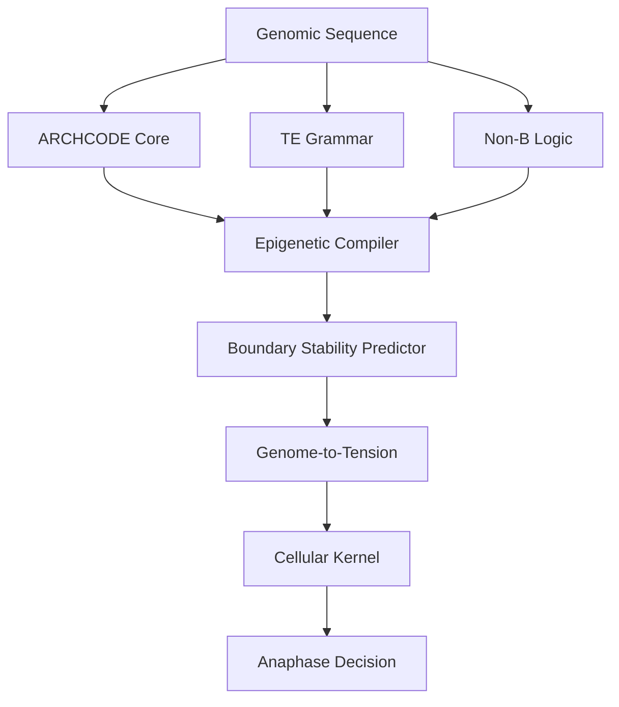

# ARCHCODE Architecture Specification

**RFC-style documentation**

## System Overview

ARCHCODE simulates 3D genome architecture and its impact on mitotic fidelity through a modular pipeline:

1. **Topology Generation** (archcode_core)
2. **TE Analysis** (te_grammar)
3. **Barrier Detection** (nonB_logic)
4. **Epigenetic Compilation** (epigenetic_compiler)
5. **Tension Mapping** (genome_to_tension)
6. **Mitotic Simulation** (cellular_kernel)

## Module Interfaces

### ARCHCODE Core

**Input**: Genomic sequence, NIPBL sites, boundary barriers  
**Output**: TAD boundaries, insulation scores, loop extrusion events

**Key Components**:
- `LoopExtrusionEngine` - Main extrusion simulation
- `Boundary` - TAD boundary representation
- `ExtrusionEvent` - Cohesin loop extrusion event

### TE Grammar

**Input**: Genomic sequence  
**Output**: TE motifs, boundary effects

**Key Components**:
- `MotifDictionary` - TE motif registry
- `TEMotif` - Motif representation

### Non-B Logic

**Input**: Genomic sequence, torque  
**Output**: Energy barriers (G4, Z-DNA, R-loops)

**Key Components**:
- `G4Model` - G4 formation model
- `ZDNAModel` - Z-DNA transition model
- `RLoopModel` - R-loop formation model
- `BarrierHierarchy` - Barrier interaction logic

### Epigenetic Compiler

**Input**: CpG sites, methylation levels  
**Output**: Updated boundary strengths, topology map

**Key Components**:
- `MethylationModel` - CpG methylation dynamics
- `CpGSite` - Methylation site representation

### Genome-to-Tension Bridge

**Input**: TAD boundaries, boundary strengths  
**Output**: Tension risks, merotelic probabilities

**Key Components**:
- `TensionMapper` - Topology-to-tension mapping
- `TensionRisk` - Risk representation

### Cellular Kernel

**Input**: Tension risks (from genome_to_tension)  
**Output**: SAC consensus, anaphase decision, LTL verification

**Integration**: Receives merotelic probabilities from genome_to_tension bridge.

## Data Flow

## Pipeline Integration

The `ARCHCODEPipeline` class integrates all modules:

1. **Boundary Definition** - Add boundaries from archcode_core
2. **Factor Collection** - Gather factors from all modules
3. **Stability Analysis** - Predict stability for each boundary
4. **Summary Statistics** - Get stability distribution

See `examples/full_pipeline_example.py` for usage.

## Engineering Unknowns

See `/risk_matrix/` for detailed specifications. All unknowns are parameterized in YAML configs with placeholder values.

## Version

1.0.0-alpha

