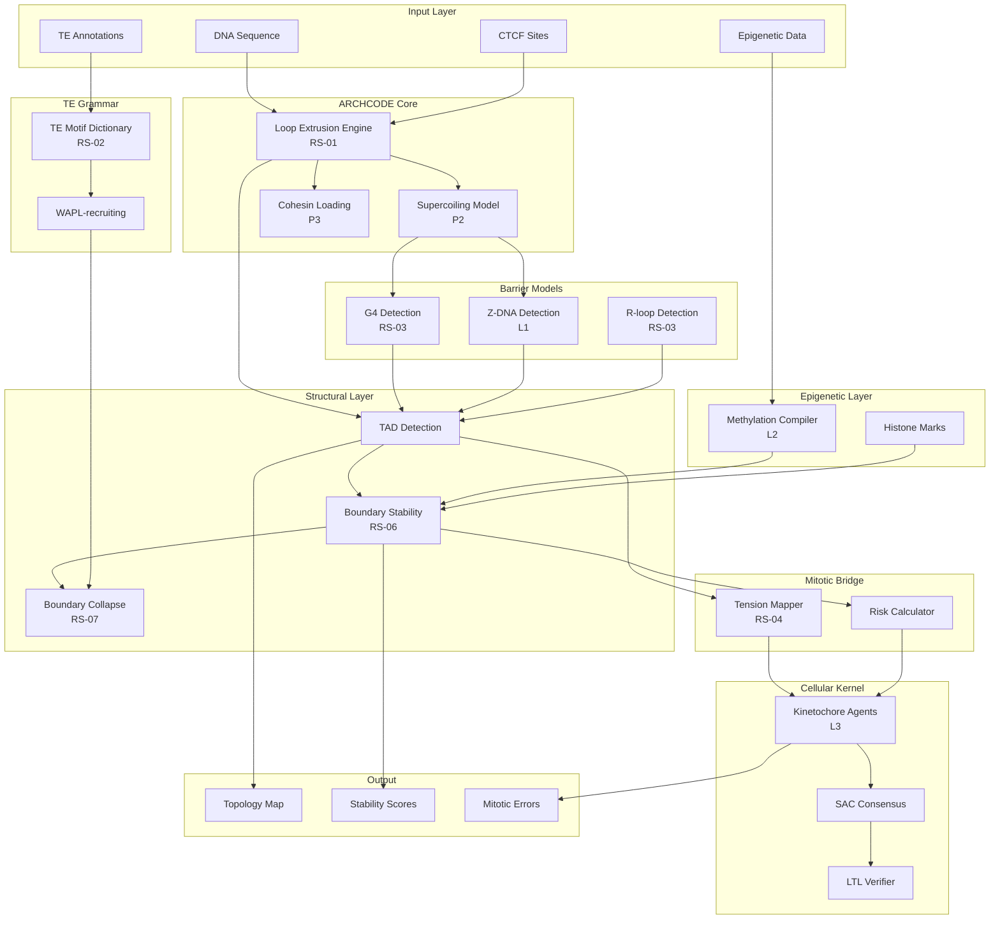
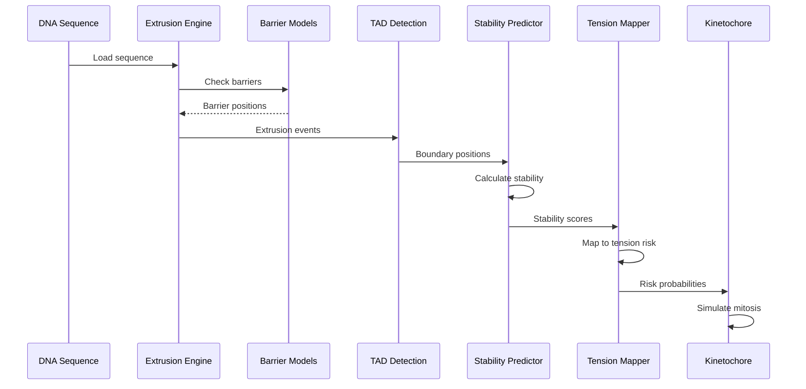
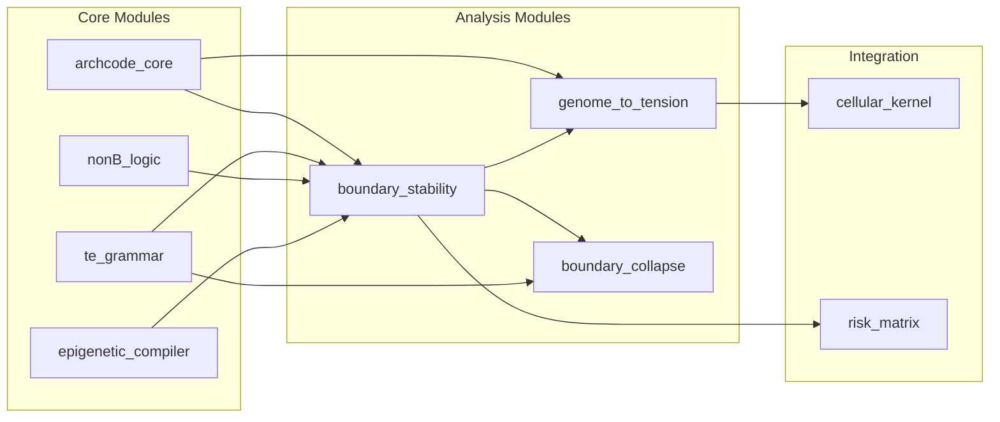
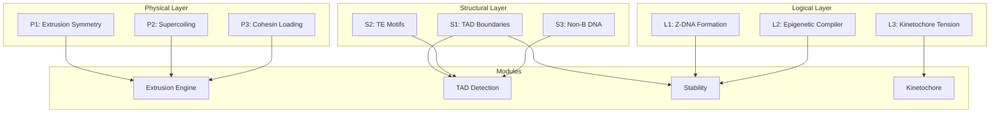
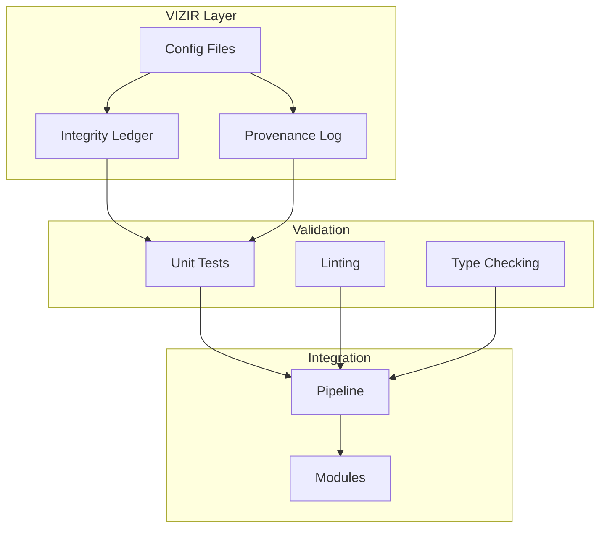

# ARCHCODE Architecture Diagram

## System Architecture

```mermaid
graph TB
    subgraph "Input Layer"
        DNA[DNA Sequence]
        CTCF[CTCF Sites]
        EPI[Epigenetic Data]
        TE[TE Annotations]
    end

    subgraph "ARCHCODE Core"
        EXT[Loop Extrusion Engine<br/>RS-01]
        SUP[Supercoiling Model<br/>P2]
        LOAD[Cohesin Loading<br/>P3]
    end

    subgraph "Structural Layer"
        TAD[TAD Detection]
        BOUND[Boundary Stability<br/>RS-06]
        COLL[Boundary Collapse<br/>RS-07]
    end

    subgraph "Barrier Models"
        G4[G4 Detection<br/>RS-03]
        ZDNA[Z-DNA Detection<br/>L1]
        RLOOP[R-loop Detection<br/>RS-03]
    end

    subgraph "Epigenetic Layer"
        METH[Methylation Compiler<br/>L2]
        HIST[Histone Marks]
    end

    subgraph "TE Grammar"
        MOTIF[TE Motif Dictionary<br/>RS-02]
        WAPL[WAPL-recruiting]
    end

    subgraph "Mitotic Bridge"
        TENSION[Tension Mapper<br/>RS-04]
        RISK[Risk Calculator]
    end

    subgraph "Cellular Kernel"
        KIN[Kinetochore Agents<br/>L3]
        SAC[SAC Consensus]
        LTL[LTL Verifier]
    end

    subgraph "Output"
        TOPO[Topology Map]
        STAB[Stability Scores]
        MITO[Mitotic Errors]
    end

    DNA --> EXT
    CTCF --> EXT
    EXT --> SUP
    EXT --> LOAD
    SUP --> G4
    SUP --> ZDNA
    EXT --> TAD
    TAD --> BOUND
    BOUND --> COLL
    
    EPI --> METH
    METH --> BOUND
    HIST --> BOUND
    
    TE --> MOTIF
    MOTIF --> WAPL
    WAPL --> COLL
    
    G4 --> TAD
    ZDNA --> TAD
    RLOOP --> TAD
    
    TAD --> TENSION
    BOUND --> RISK
    TENSION --> KIN
    RISK --> KIN
    
    KIN --> SAC
    SAC --> LTL
    
    TAD --> TOPO
    BOUND --> STAB
    KIN --> MITO
```

## Data Flow

```mermaid
sequenceDiagram
    participant DNA as DNA Sequence
    participant EXT as Extrusion Engine
    participant BAR as Barrier Models
    participant TAD as TAD Detection
    participant STAB as Stability Predictor
    participant TENS as Tension Mapper
    participant KIN as Kinetochore

    DNA->>EXT: Load sequence
    EXT->>BAR: Check barriers
    BAR-->>EXT: Barrier positions
    EXT->>TAD: Extrusion events
    TAD->>STAB: Boundary positions
    STAB->>STAB: Calculate stability
    STAB->>TENS: Stability scores
    TENS->>TENS: Map to tension risk
    TENS->>KIN: Risk probabilities
    KIN->>KIN: Simulate mitosis
```

## Module Dependencies

```mermaid
graph LR
    subgraph "Core Modules"
        A[archcode_core]
        B[te_grammar]
        C[nonB_logic]
        D[epigenetic_compiler]
    end

    subgraph "Analysis Modules"
        E[boundary_stability]
        F[genome_to_tension]
        G[boundary_collapse]
    end

    subgraph "Integration"
        H[cellular_kernel]
        I[risk_matrix]
    end

    A --> E
    B --> E
    C --> E
    D --> E
    
    A --> F
    E --> F
    
    E --> G
    B --> G
    
    F --> H
    E --> I
```

## Configuration Layers

```mermaid
graph TB
    subgraph "Physical Layer"
        P1[P1: Extrusion Symmetry]
        P2[P2: Supercoiling]
        P3[P3: Cohesin Loading]
    end

    subgraph "Structural Layer"
        S1[S1: TAD Boundaries]
        S2[S2: TE Motifs]
        S3[S3: Non-B DNA]
    end

    subgraph "Logical Layer"
        L1[L1: Z-DNA Formation]
        L2[L2: Epigenetic Compiler]
        L3[L3: Kinetochore Tension]
    end

    subgraph "Modules"
        EXT[Extrusion Engine]
        TAD[TAD Detection]
        STAB[Stability]
        KIN[Kinetochore]
    end

    P1 --> EXT
    P2 --> EXT
    P3 --> EXT
    
    S1 --> TAD
    S2 --> TAD
    S3 --> TAD
    
    S1 --> STAB
    L1 --> STAB
    L2 --> STAB
    
    L3 --> KIN
```

## VIZIR Framework

```mermaid
graph TB
    subgraph "VIZIR Layer"
        LEDGER[Integrity Ledger]
        PROV[Provenance Log]
        CONFIG[Config Files]
    end

    subgraph "Validation"
        TEST[Unit Tests]
        LINT[Linting]
        TYPE[Type Checking]
    end

    subgraph "Integration"
        PIPELINE[Pipeline]
        MODULES[Modules]
    end

    CONFIG --> LEDGER
    CONFIG --> PROV
    LEDGER --> TEST
    PROV --> TEST
    TEST --> PIPELINE
    LINT --> PIPELINE
    TYPE --> PIPELINE
    PIPELINE --> MODULES
```

