# Unknome + 3D Integration (3D-Guided Unknomics)

Date: 2026-03-06  
Goal: Prioritise Unknome genes (poorly characterised, evolutionarily conserved) by 3D chromatin structural vulnerability using ARCHCODE.

## 1. Unknome Data Source

- **Project:** [Unknome Database](https://unknome.mrc-lmb.cam.ac.uk/about/) (MRC LMB).
- **Citation:** Rocha J, Jayaram SA, Stevens TJ, et al. (2023). Functional unknomics: Systematic screening of conserved genes of unknown function. *PLoS Biol* 21(8): e3002222. PMID: 37552676; bioRxiv 2022.06.28.497983.
- **Content:** Proteins ranked by "knownness" (max GO terms in the orthologue cluster). Low knownness = understudied; many are conserved and essential (e.g. RNAi screens in *Drosophila*).
- **Downloads (human + model organisms):**
  - Full DB: [SQLite3](https://unknome.mrc-lmb.cam.ac.uk/download/db_sql) (5.3 GiB).
  - Summary by cluster: [clust_tsv_gz](https://unknome.mrc-lmb.cam.ac.uk/download/clust_tsv_gz) (2.8 MiB) or [clust_tsv](https://unknome.mrc-lmb.cam.ac.uk/download/clust_tsv) (8.0 MiB).
  - Summary by protein: [prot_tsv_gz](https://unknome.mrc-lmb.cam.ac.uk/download/prot_tsv_gz) (54.2 MiB) or [prot_tsv](https://unknome.mrc-lmb.cam.ac.uk/download/prot_tsv) (252.6 MiB).
- **License:** [CC BY 4.0](https://creativecommons.org/licenses/by/4.0/) for copyrightable parts; data provided "as-is", no warranty.
- **Limitations:** Organism and assembly depend on the download (Unknome v3, updated Oct 2024). Gene identifiers are typically UniProt / Panther cluster; mapping to GRCh38 coordinates requires Ensembl or equivalent.

## 2. Pipeline Design

High-level flow: **Unknome gene list → regulatory window (TSS ± window) → ARCHCODE (or simplified sensitivity) → 3D-vulnerability score → ranking.**

```mermaid
flowchart LR
  subgraph input [Input]
    U[Unknome clust/prot TSV]
    F[Filter human low knownness]
  end
  subgraph map [Mapping]
    G[Gene symbol / UniProt ID]
    E[Ensembl or ref TSS]
    W[Regulatory window TSS plus minus 50-100kb]
  end
  subgraph arch [ARCHCODE]
    C[Locus config or generic]
    S[In silico mutation scan]
    L[LSSIM per bin or variant]
  end
  subgraph out [Output]
    V[3D vulnerability score]
    R[Ranked gene list]
  end
  U --> F
  F --> G
  G --> E
  E --> W
  W --> C
  C --> S
  S --> L
  L --> V
  V --> R
```

- **Step 1 (data):** Download Unknome clust_tsv (or prot_tsv); filter to human; optionally restrict to knownness below a threshold. Output: list of gene symbols or UniProt IDs.
- **Step 2 (coordinates):** Map each gene to GRCh38 TSS (Ensembl REST, or precomputed table). Define regulatory window (e.g. TSS ± 50 kb or ± 100 kb).
- **Step 3 (ARCHCODE):** For each window either (a) use an existing locus config if the gene is one of our 13 loci (HBB, BRCA1, CFTR, …), or (b) build a minimal locus config (CTCF/enhancers from ENCODE/ROADMAP for that window). Run in-silico mutation scan: for each bin (or a sample), apply occupancy drop or effect strength and compute LSSIM. Aggregate to a **3D-vulnerability score** (e.g. fraction of bins with LSSIM &lt; 0.95, or mean LSSIM drop).
- **Step 4 (ranking):** Sort Unknome genes by 3D-vulnerability (higher vulnerability = lower LSSIM or higher fraction sensitive). Output: `results/unknome_3d_priority_*.json` (and optionally CSV).

## 3. Scripts and Configs

| Item | Path | Role |
|------|------|------|
| Unknome gene list (stub or derived) | `config/unknome_genes_subset.json` | Human gene symbols (and optional knownness) to prioritise; can be filled from Unknome download. |
| Locus configs | `config/locus/*.json` | Existing ARCHCODE loci; used when Unknome gene matches a locus (e.g. HBB, BRCA1). |
| Prototype script | `scripts/unknome-3d-priority.ts` | Reads gene list; maps to locus; runs in-silico scan; writes `results/unknome_3d_priority_<date>.json`. |
| Output | `results/unknome_3d_priority_*.json` | Ranked list with gene, locus_id, vulnerability score, provenance. |

## 4. 3D-Vulnerability Score (Operational)

- For loci with an existing ARCHCODE config: sample bins in the regulatory span (e.g. promoter/enhancer bins); for each bin, simulate a fixed perturbation (e.g. occupancy × 0.05); compute LSSIM(wt, mut). **Score** = 1 − mean(LSSIM) over bins, or fraction of bins with LSSIM &lt; 0.95. Higher score ⇒ more structurally vulnerable.
- If no locus config exists for a gene: skip or mark "no_config"; future work can add ENCODE-derived configs per window.

## 5. Provenance and Claim Level

- Unknome data: EXPLORATORY (prioritisation list) unless validated experimentally.
- 3D-vulnerability: EXPLORATORY; document command, artifact path, and data provenance in runs (see [VALIDATION_PROTOCOL.md](VALIDATION_PROTOCOL.md)).

## 6. First Artifact (Prototype)

- **Command:** `npx tsx scripts/unknome-3d-priority.ts`
- **Output:** `results/unknome_3d_priority_<YYYY-MM-DD>.json` (e.g. [results/unknome_3d_priority_2026-03-05.json](../results/unknome_3d_priority_2026-03-05.json))
- **Content:** Ranked list of genes (from `config/unknome_genes_subset.json`) with `vulnerability_score`, `mean_lssim`, `fraction_below_095`; claim level EXPLORATORY.
